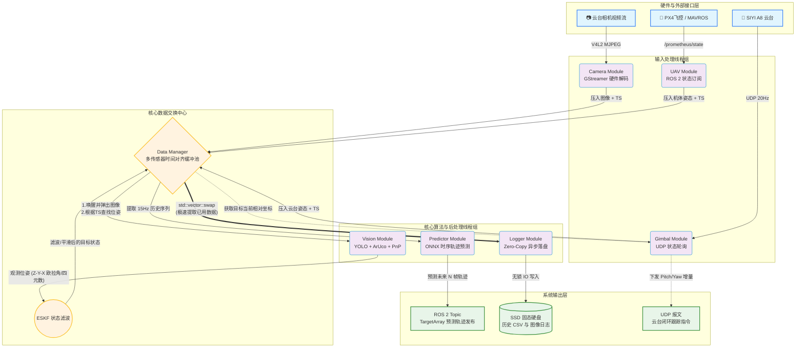

# UAV Vision Tracking & Trajectory Prediction System
**(无人机视觉目标跟踪与时序轨迹预测系统)**

## 📝 项目简介
本项目是一个部署在机载计算平台（NVIDIA Jetson Xavier）上的高性能无人机视觉感知与预测系统。系统通过控制二维云台相机（SIYI A8 mini），在复杂室外环境下对动态目标进行实时视觉检测、6DoF位姿估计、状态滤波平滑，并利用深度学习时序模型预测目标未来轨迹。

## ✨ 核心亮点 (Key Features)
- 🚀 性能优化：采用 GStreamer 管道调用 Jetson 硬件解码 (NVDEC) 获取 4K 视频流；ONNX Runtime 结合 CUDA/TensorRT 进行模型推理。
- ⏱️ 多传感器时间同步：设计了基于时间戳的高效缓存池，解决相机 (30Hz)、云台 (20Hz)、飞控 (50Hz) 频率不一导致的“异步”问题。
- 🧠 混合视觉感知算法：结合HSV颜色空间过滤搭配 YOLO (ONNX) 粗定位与 ArUco 码精定位，利用 SolvePnP 解算目标相对位姿，并通过严密的坐标系变换（相机->云台->机体->世界）获取全局绝对位姿。并妥善处理了云台的跟随模式与绝度模式的欧拉角补偿
- 📉 误差状态卡尔曼滤波 (ESKF)：针对四元数姿态的非线性特性，运用流形（Manifold）的误差状态卡尔曼滤波(ESKF)，在切空间(Tangent Space)上对旋转向量的误差进行卡尔曼更新，最后再映射回名义状态 进行目标状态的平滑与高频重采样。
- 🔮 时序轨迹预测：集成基于 Transformer 架构 (PatchTST) 的时序预测模型，利用历史平滑轨迹推演未来目标运动趋势。

## 🔄 系统架构与数据流向 (System Architecture & Data Flow)
系统采用高度解耦的多线程架构，所有模块通过中心化的 DataManager 进行数据交互，保证了各模块的非阻塞运行。

## 核心模块说明
- **Camera Module**: 独立线程。通过 GStreamer 直接将底层 V4L2 视频流硬件解码并转为 BGR 格式，打上纳秒级统一时间戳后推入缓存。
- **Gimbal Module**: 独立线程。通过 UDP 协议与云台通信，以 20Hz 轮询云台当前的 Pitch/Yaw 角度与 Zoom 倍率，并将控制算法生成的追踪角度下发。
- **UAV Module**: 基于 ROS 2 节点，订阅 ```/uav1/prometheus/state```，获取无人机自身在世界坐标系下的高精度位置、速度与四元数姿态。
- **Vision Module**: 消费者线程。阻塞等待新图像，获取图像后回溯匹配同一时间戳的云台和无人机状态。通过多种方案获取目标角点信息，单目情况下采用```cv::solvePnP```，双目情况下采用视差法定位，求解相机系下位姿，最后采用严密的矩阵变换：$R_{world}=R_{uav}×R_{gimbal}×R_{cam}$得到世界坐标。识别方案如下：最终采用方案4：
  - 方案1：两层ONNX串联，先识别目标ROI，再用二级ONNX识别ROI上的精细角点（如黑色小块）
  - 方案2：ONNX识别目标ROI，再用zbar识别目标二维码，获取二维码角点
  - 方案3：ONNX识别目标ROI，再用aruco识别目标定位块，获取定位块角点
  - 方案4：在HSV颜色空间对目标进行过滤，运用膨胀腐蚀，配合最小矩形逼近```cv::minAreaRect```，获取目标角点；再通过ONNX识别目标上的标记，即可对角点进行排序；远距离识别目标角点，近距离可在该基础上进一步识别aruco角点
- **Target State Predictor**: 定时器驱动。拉取 ESKF 滤波后的 15Hz 历史数据形成序列（Sequence），输入 ONNX 预测模型，输出未来 N 帧的三维坐标和姿态轨迹，发布为 ROS 2 TargetArray 供规划层使用。
- **Data Logger Module**: 低优异步落盘线程。定期将各类缓存中的历史状态（无人机、云台、目标）和检测图像刷入 SSD，用于复盘分析。
## 数据流向说明
- **输入阶段 (Hardware -> Data Manager)**：
  - Camera Module 独立线程利用 Jetson 硬件解码 4K 视频流，打上系统纳秒级时间戳（TS）后推入队列。
  - Gimbal Module 与 UAV Module 分别以高频获取云台和无人机的实时姿态，存入带有时间戳的红黑树（std::map）中。
- **感知阶段 (Data Manager -> Vision Module -> ESKF)**：
  - Vision Module 被新图像唤醒，向 Data Manager 请求与该图像曝光时间最接近的机体和云台状态。
  - 视觉解算（YOLO+ArUco+PnP）得到目标相对相机的位姿后，结合坐标系变换矩阵，计算出目标在世界系下的绝对坐标，并送入 ESKF 进行非线性姿态滤波与位置平滑。
- **预测与闭环阶段 (Predictor & Gimbal Control)**：
  - Predictor Module 定时拉取过去一段时间内的平滑轨迹队列，送入 ONNX 部署的 PatchTST 模型，将未来的预测点阵列通过 ROS 2 发布给规划节点。
  - Gimbal Module 定期获取目标最新相对位置，计算所需的偏航与俯仰增量，闭环控制云台将目标锁定在视野中心。
- **日志落盘 (Logger)**：
  - Logger Module 定期通过指针交换（Swap）以几乎零耗时的方式拿走缓存池中已经使用过的数据，在后台缓慢写入 SSD，不挤占核心线程的 CPU 时间。

## 🗄️ 核心数据结构设计：缓冲池 (Buffer Pool Design)
作为整个系统的大脑，DataManager 的设计直接决定了系统的并发性能与数据一致性。针对不同特性的数据，采用了差异化的数据结构与锁策略：
### 1. 基于红黑树的时间轴对齐池 (Time-Aligned State Map)
- **痛点**：无人机状态（飞控发送）与图像采集不仅频率不同，且存在传输延迟。
- **设计**：使用```std::map<TimestampNS, UAV_Row>```存储无人机和云台的历史状态。利用 map 键值有序的特性，在视觉模块拿到时间戳为 t 的图像时，调用 ```std::map::lower_bound(t)``` 快速查找时间上最贴近该图像曝光时刻的无人机和云台状态。
- **内存控制**：限制 Map 最大长度，超出时自动将旧数据 ```std::move``` 到待持久化队列，防止内存泄漏。
### 2. 生产者-消费者图像队列 (Condition Variable Queue)
- **设计**：采用 ```std::deque<Img_Row>``` 结合 ```std::mutex``` 和 ```std::condition_variable```。
- **机制**：视觉线程通过 ```cv.wait_for``` 挂起，不消耗 CPU。相机线程一推入新图立刻 ```notify_one()``` 唤醒视觉线程。
- **防堆积策略**：若处理过慢，队列超长时主动丢弃或仅保存旧图，保证视觉算法处理的永远是最新一帧，极大降低控制系统的延迟。
### 3. “零拷贝”极速落盘队列 (Zero-Copy Logging via Swap)
- **痛点**：日志落盘（写文件、写图片）是极慢的 I/O 操作，如果加锁时间过长，会阻塞核心的高频通信与检测线程。
- **设计**：在 ```DataManager::popUsedData()``` 中，定义了 ```used_uav_history_``` 等本地缓存 ```std::vector```。
- **技巧**：```Logger``` 线程读取数据时，不进行数据的逐个拷贝，而是直接使用 ```std::vector::swap()``` 将 ```DataManager``` 中的数据指针与 ```Logger``` 的局部空 ```vector``` 进行交换。锁的占用时间仅为指针交换的时间（纳秒级），随后 ```Logger``` 在无锁状态下慢悠悠地进行磁盘 I/O 操作。

## 🛠️ 技术栈 (Tech Stack)
- **语言**：C++ 17, Python (数据分析与可视化)
- **中间件**：ROS 2 (Humble), MAVROS, Prometheus UAV Control
- **计算机视觉**：OpenCV 4.x (CUDA 模块加速), ZBar, cv::Aruco
- **深度学习**：ONNX Runtime (C++ API, TensorRT/CUDA Execution Provider)
- **数学与滤波**：Eigen 3 (矩阵运算与四元数), 误差状态卡尔曼滤波 (ESKF)
- **多线程**：```<thread>, <mutex>, <condition_variable>, <atomic>```

# 量化指标：

# 现存问题：
## 目标画圈/漂移
- 1.系统时间戳不同步（Time Synchronization）—— 可能性 60%
- 2.外参标定误差（Extrinsic Calibration）—— 可能性 80%
- 3.云台随动反馈延迟（Gimbal Latency）—— 可能性 30%
  - 做一个补偿$\theta_{now}=\theta_{msg}+\omega×\Delta t$